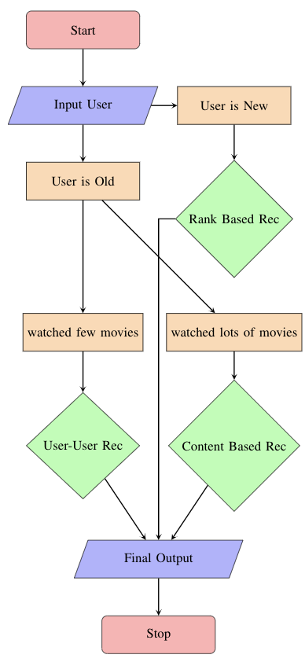

# Netflix Recommendation System 
### This is a final project for the Numerical Linear Algebra in Big Data course at Stevens Institute of Technology. 

### In this project we designed three type of most popular recommendation system. 

### Data Source: https://www.kaggle.com/netflix-inc/netflix-prize-data

## Rank Based Recommendation
Rank-Based Recommendation is the most fundamental recommendation
system. Because of the Rank-Based, users could
know what is popular currently. For example, Netflix always
displays a row called ”Popular on Netflix,” which will let
users know the popular series recently. Like Netflix, our Rank-
Based Recommendation could count the views of movies and
recommend the most viewed movies to users. If we set the
recommend movies amount as 10, users will get the Top 10
viewed movie’s names.

## User-User Based Recommendation 
Collaborative Filtering is the most common technique used
when it comes to building intelligent recommender systems
that can learn to give better recommendations as more information
about users is collected.

## Content Based Recommendation 
Content-based recommendation systems recommend items
to a user by using the similarity of items. This recommender
system recommends products or items based on their
description or features. It identifies the similarity between
the products based on their descriptions. It also considers
the user’s previous history in order to recommend a similar
product.

## System Design 

